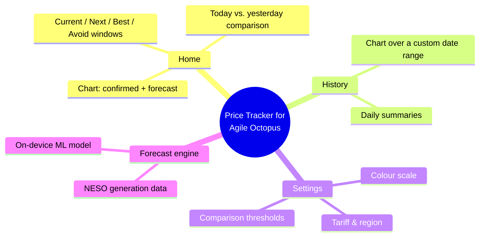
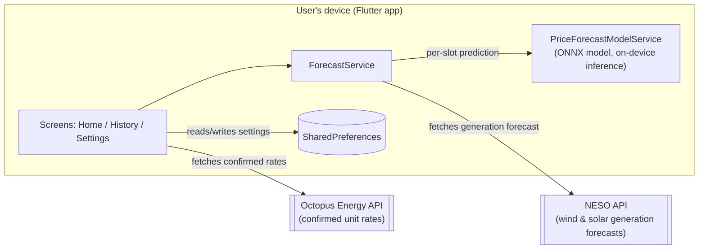
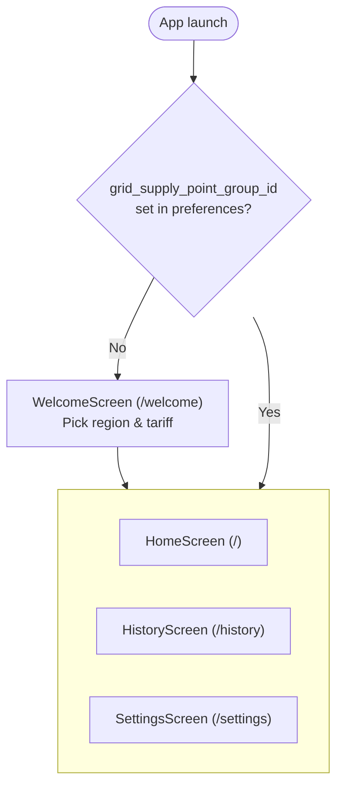
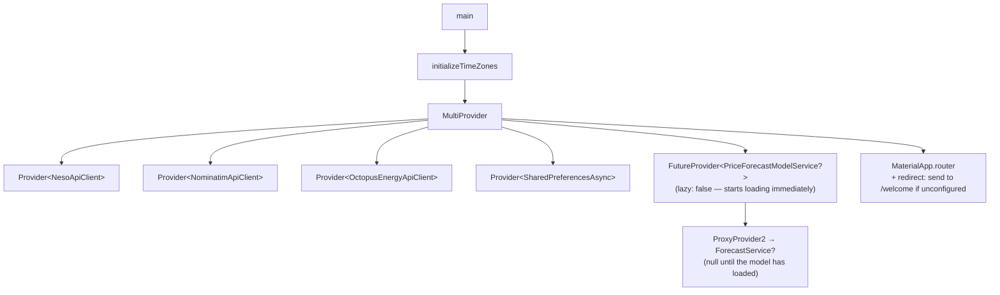
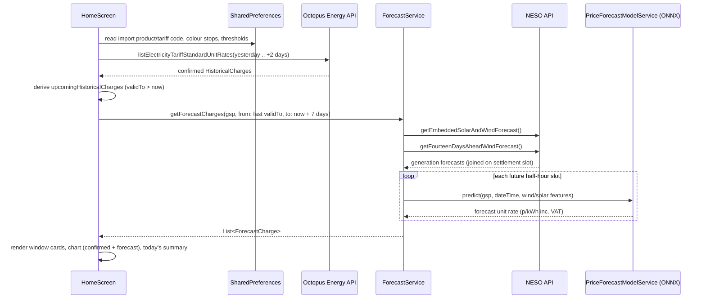
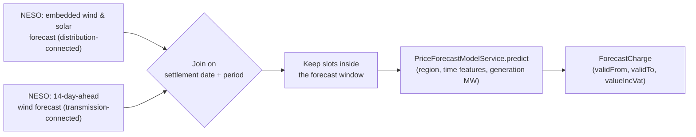
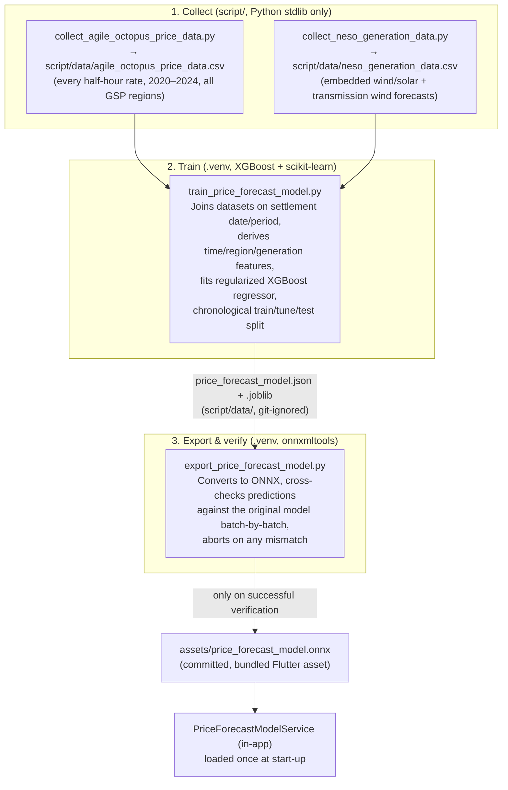
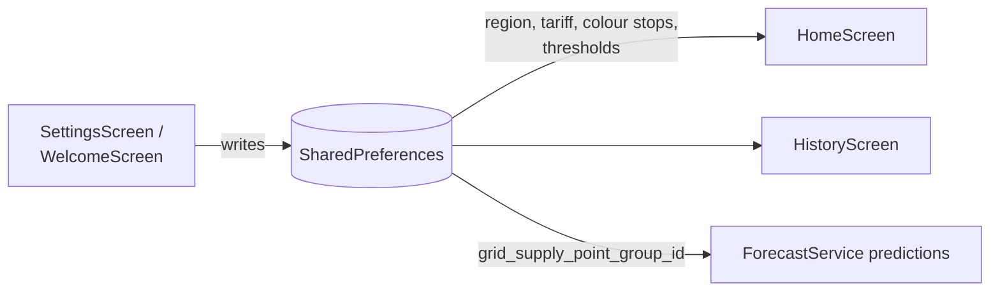

# Price Tracker for Agile Octopus

Price Tracker for Agile Octopus is a [Flutter](https://flutter.dev/) app that tracks
[Octopus Energy's](https://octopus.energy/) Agile tariff — a UK electricity tariff whose
unit rate changes every half hour. The app shows the confirmed rates Octopus has
published, a seven-day rate forecast for the period ahead of that, and historical trends,
so a user can see at a glance when electricity is cheap and when it's expensive.

> Please note that Price Tracker for Agile Octopus is unofficial and not endorsed by Octopus Energy.

## Contents

- [What the app does](#what-the-app-does)
- [How it's built](#how-its-built)
- [Screens and navigation](#screens-and-navigation)
- [App start-up](#app-start-up)
- [The Home screen in detail](#the-home-screen-in-detail)
- [The price forecast](#the-price-forecast)
- [The price forecast model pipeline](#the-price-forecast-model-pipeline)
- [Settings and persistence](#settings-and-persistence)
- [Project layout](#project-layout)
- [Getting started](#getting-started)
- [Testing](#testing)

## What the app does

Agile Octopus prices are set a day ahead and published as 48 half-hour "slots" per day.
Because the rate follows wholesale electricity prices (which are strongly affected by
how much wind and solar generation is on the grid), the cheapest and most expensive times
to use electricity move around from day to day. This app helps a user answer three
questions:

- **What's the rate right now, and what's coming up today?** (Home screen)
- **What's the rate likely to be over the next week**, even though Octopus hasn't
  published it yet? (the on-device forecast)
- **How have rates behaved over the past days, months or years?** (History screen)



## How it's built

The app is a single Flutter codebase targeting Android, iOS, Windows, macOS, Linux and
web. It talks to two external HTTP APIs and runs one machine-learning model locally,
on-device.

| Concern                          | Package/tool                                                                                                         |
|----------------------------------|----------------------------------------------------------------------------------------------------------------------|
| UI framework                     | [Flutter](https://flutter.dev/) / Material                                                                           |
| Routing                          | [go_router](https://pub.dev/packages/go_router) (code-generated, type-safe routes)                                   |
| App-wide state / DI              | [provider](https://pub.dev/packages/provider)                                                                        |
| Local persistence                | [shared_preferences](https://pub.dev/packages/shared_preferences)                                                    |
| Octopus Energy data              | [octopus_energy_api_client](https://pub.dev/packages/octopus_energy_api_client)                                      |
| NESO generation forecasts        | Hand-written `NesoApiClient` (`lib/forecast/neso_api_client.dart`)                                                   |
| Charts                           | [syncfusion_flutter_charts](https://pub.dev/packages/syncfusion_flutter_charts)                                      |
| On-device ML inference           | [flutter_onnxruntime](https://pub.dev/packages/flutter_onnxruntime) running a bundled [ONNX](https://onnx.ai/) model |
| Geocoding (postcode → region)    | [nominatim_api_client](https://pub.dev/packages/nominatim_api_client)                                                |
| Model training (offline, Python) | XGBoost, scikit-learn, `onnxmltools` (see `script/`)                                                                 |



## Screens and navigation

Navigation is defined declaratively with `go_router` in `lib/common/shell_route.dart`
and `lib/welcome/welcome_route.dart`, and code generation (`go_router_builder`) produces
the type-safe route classes (the `*.g.dart` files). A persistent shell
(`ShellScreen`) wraps three tabs — Home, History and Settings — behind a bottom
navigation bar or navigation rail, depending on the window's width.



`ShellScreen` (`lib/common/shell_screen.dart`) picks between
`ShellBottomNavigationBar` (narrow windows — phones) and `ShellNavigationRail`
(wide windows — desktop/tablet) using a `LayoutBuilder`, so the same three routes work
across every supported platform.

## App start-up

`lib/main.dart` wires up dependency injection with a `MultiProvider` before the first
frame is built. This is the backbone the rest of the app depends on:



Two providers are notably asynchronous and start out `null`:

- `PriceForecastModelService?` begins loading the bundled ONNX model at start-up
  (`lazy: false`) so it's ready by the time a forecast is needed, but is `null` until
  that load completes.
- `ForecastService?` is derived from it via a `ProxyProvider2`, so it's also `null`
  until the model has finished loading — screens that need a forecast simply treat a
  `null` service as "not ready yet" and show confirmed prices on their own in the
  meantime.

## The Home screen in detail

`HomeScreen` (`lib/home/home_screen.dart`) is the most data-heavy screen. It fetches one
wide window of confirmed rates (yesterday through two days ahead) that's reused by every
widget on the screen, and layers a forecast fetch on top once the model is ready.



The screen renders, top to bottom:

- **`HistoricalChargeWindowWrap`** — Current / Next / Best / Avoid rate cards for the
  upcoming slots.
- **`HistoricalChargeChartCard`** — a chart plotting confirmed rates as a solid line and
  forecast rates as a continuation, colored by the user's configured color scale. Shown
  once the forecast resolves (or indefinitely as confirmed-only if the forecast never
  becomes available).
- **`HistoricalChargeTodaysSummaryCard`** — today's average/min/max versus yesterday's,
  hours below the user's configured threshold, and a comparison against the user's
  chosen flat-rate tariff.

`HistoryScreen` (`lib/history/history_screen.dart`) reuses the same chart card and
color-stop concept over a user-selected date range (7 days / 30 days / 3 months / 12
months, or a custom range), with a scrollable list of daily summaries below it.

## The price forecast

Octopus publishes Agile rates only about a day ahead, but the Home screen chart shows a
full week. `ForecastService` (`lib/forecast/forecast_service.dart`) fills that gap by
turning a live weather/generation outlook into a plausible price for each future
half-hour slot:



Each `ForecastCharge` deliberately mirrors the three fields the chart reads off a
confirmed `HistoricalCharge` (`validFrom`, `validTo`, `valueIncVat`), so the chart can
plot both series without needing to know which one is which.

## The price forecast model pipeline

The forecast is powered by a small, regularized [XGBoost](https://xgboost.readthedocs.io/)
gradient-boosted tree model, trained offline in Python and shipped as an
[ONNX](https://onnx.ai/) file so it can run **entirely on-device** via
[onnxruntime](https://onnxruntime.ai/) — no server call, and it also works offline. This
replaced an earlier, simpler seasonal-average lookup table
(`assets/seasonal_average_lookup.json`), which could only return a historical bucket
average rather than a continuous, weighted prediction.



The model's input features, in order, are: half-hour-of-day, is-weekend, is-evening-peak
(16:00–19:00 local), month, Grid Supply Point region (ordinal-encoded), and the three
NESO generation forecasts (embedded wind, embedded solar, transmission wind), all in
megawatts. Its single output is the forecast unit rate in pence per kWh, inclusive of
VAT. See [CONTRIBUTING.md](CONTRIBUTING.md) for exact commands to regenerate every stage
of this pipeline.

## Settings and persistence

All user preferences are stored locally with `shared_preferences` — nothing about the
user is sent anywhere. `SettingsScreen` (`lib/settings/settings_screen.dart`) exposes:

- **Tariff & region** (`TariffFormCard`) — the user's Grid Supply Point region, import
  product/tariff code, and whether to auto-select the latest Agile product.
- **Color scale** (`ColorStopsFormCard`) — the price → color gradient used throughout
  the charts and textual summaries.
- **Today's summary thresholds** (`TodaysSummaryFormCard`) — the "hours below" threshold
  and the flat-rate tariff to compare against.

The same `grid_supply_point_group_id` preference doubles as the signal for whether
onboarding is complete: `main.dart`'s router `redirect` sends the user to
`WelcomeScreen` (which embeds the same `TariffFormCard`) whenever that key is unset, and
back to the main shell once it's saved.



## Project layout

```
lib/
├── main.dart              # Providers, theming, router, GSP/tariff constants
├── common/                 # Shell scaffold (tab bar / nav rail), shared widgets & helpers
├── forecast/                # ForecastService, NesoApiClient, PriceForecastModelService
├── home/                    # Home screen: current/next/best/avoid, chart, today's summary
├── history/                  # History screen: date-range chart + daily summaries
├── settings/                 # Settings forms: tariff, colour stops, thresholds, about
└── welcome/                  # First-run onboarding screen

script/                     # Python: dataset collection + model training/export (see CONTRIBUTING.md)
assets/price_forecast_model.onnx  # The committed, bundled ML model
test/                        # Widget/unit tests, mirroring the lib/ structure
```

## Getting started

This is a standard Flutter app. With the [Flutter SDK](https://docs.flutter.dev/get-started/install)
installed:

```shell
flutter pub get
flutter run
```

The bundled `assets/price_forecast_model.onnx` is committed to the repository, so the
app builds and forecasts out of the box — you only need the steps in
[CONTRIBUTING.md](CONTRIBUTING.md) if you want to regenerate the datasets or retrain the
model yourself.

## Testing

```shell
flutter test
```

Tests live under `test/`, mirroring the `lib/` folder structure, with a shared
`test/helpers.dart` for common test setup (e.g., wrapping widgets with the providers they
expect).
